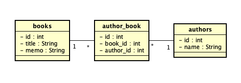
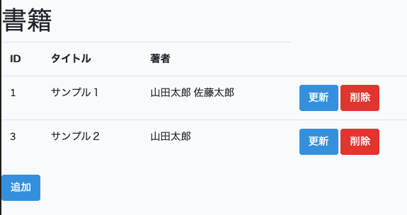
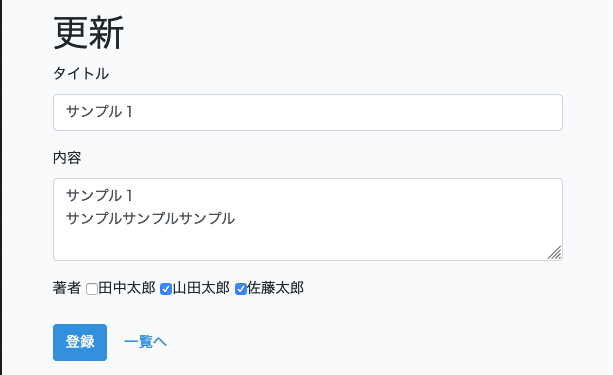

# LaravelにおけるN対Nリレーションをやってみた

## 目的
Laravel上でN対Nリレーションのものを何か実装してみる。

## 前提
下記の環境で実装した。

* PHP7.1.x
* Laravel5.8.x
* PostgreSQL11.4

上記環境にてN対Nのリレーションを用いたものを実装してみた。

## サンプル仕様
本とその著者について考える。
本には著者が必ずいるが一人とは限らない。また著者は本を複数冊出す。
よって本と著者の関係はN対Nになる。
そこで、下記のようなテーブル構造とする。


サンプルのために簡略化のため本はタイトルと内容のみ、著者は名前のみとする。 　

画面構成は

* 書籍一覧


* 書籍詳細


の２画面とする。 　
また簡略化のため、authorsテーブルには既に３人の著者を登録済みとする。

## 実装手順

下記の手順で実装した。

* モデル作成
* コントローラー作成
* ビューの作成

### モデル作成
まず、books（書籍データ)のモデルを作成する。Laravelなのでartisanで雛形作成する。

```
% php artisan make:model book --migration
```

以上でBook.phpとbooksのミグレーションファイルが作成される。
同様にauthors（著者データ）のモデルも作成する。

```
% php artisan make:model author --migration
```

まず、ミグレーションを片付けてしまおう。

```php:****_create_books_table.php
<?php
〜 省略 〜

class CreateBooksTable extends Migration
{
    /**
     * Run the migrations.
     *
     * @return void
     */
    public function up()
    {
        Schema::create('books', function (Blueprint $table) {
            $table->bigIncrements('id'); // ここから
            $table->string("title");
            $table->text("memo");
            $table->timestamps();        // ここまでを追加記述
        });
    }

〜 省略 〜
}
```

```php:****_create_authors_table.php
<?php
〜 省略 〜

class CreateAuthorsTable extends Migration
{
    /**
     * Run the migrations.
     *
     * @return void
     */
    public function up()
    {
        Schema::create('authors', function (Blueprint $table) {
            $table->bigIncrements('id'); // ここから
            $table->string("name");
            $table->timestamps();        // ここまでを追加記述
        });
    }
〜 省略 〜
}
```

また、リンクテーブルを作成する必要があるので、モデルは作成する必要がないため、ミグレーションのみ作成する。

```
% php artisan make:migration author_book
```
```php:****_create_author_book_table.php
<?php
〜 省略 〜
class CreateBookAuthor extends Migration
{
    /**
     * Run the migrations.
     *
     * @return void
     */
    public function up()
    {
        Schema::create('book_author', function (Blueprint $table) {
            $table->bigIncrements('id');  // ここから
            $table->integer("book_id");
            $table->integer("author_id"); // ここまでを追加記述
        });
    }
〜 省略 〜
}
```

ここでまずテーブルを作成してしまう。

```
% php artisan migrate
```

これでデータベースの準備は整ったので、モデルのリレーション設定を行う。
まずbookモデル

```php:Book.php
<?php

namespace App;

use Illuminate\Database\Eloquent\Model;

class Book extends Model
{
    public function authors() {
      return $this->belongsToMany(Author::class);
    }
}
```
authorsとリンクするので、authors()メソッドを作成して、belongsToMany()を上記のように記述する。
同様にauthorsモデル

```php:Book.php
<?php

namespace App;

use Illuminate\Database\Eloquent\Model;

class Author extends Model
{
    public function books() {
      return $this->belongsToMany(Book::class);
    }
}
```

以上で、モデルの作成は終了である。

### コントローラ
booksのコントローラーを作成する。
例によってartisanにて雛形を作成する。

```
% php artisan make:controller BookController --resource --model=Book
```
以上でコントローラーの雛形が作成される。
ルーティングは下記のように設定した。

```php:routes/web.php
Route::resource("books","BookController");
```

コントローラーの中身を埋めていこう。

#### index(書籍一覧）
indexは特に説明することはないが、Bookモデルでリレーションの設定をしているため、
Authorを取得するコードを記述する必要はない。

```php:BookController.php
public function index()
{
    $books = Book::get();
    return view("books.index",["books"=>$books]);
}
```

#### create（書籍登録画面）
新規登録画面である。Authorのチェックボックスを作成するため、Authorのリストが必要になる。

```php:BookController.php
public function create()
{
    $authors = Author::pluck("name","id")->toArray();
    return view("books.create",compact('authors'));
}
```

#### store（書籍登録実行）
bookレコード作成とauthorとのリンク(author_book)レコードの作成を行う。

```php:BookController.php
public function store(Request $request)
{
  // フォーム値からauthor_idの配列を抜き出す。
   $authors = $request->input("author_id",[]);
   unset($request["author_id"]);

   // bookの登録
   $book = new Book();
   $book->title = $request->title;
   $book->memo = $request->memo;
   $book->save();

  // authorとのリレーションレコードを登録
   $book->authors()->attach($authors);

    return redirect(
        route("books.edit",$book->id))
      ->with("flash_message","保存しました");
}
```

```
$book->authors()->attach($authors);
```
の一行でリンクテーブルのレコードを作成してくれる。

#### edit(書籍更新画面）
更新画面である。これもAuthorのチェックボックスを作成するため、Authorのリストが必要になる。

```php:BookController.php
public function edit(Book $book)
{
   $authors = Author::pluck("name","id")->toArray();
   return view("books.edit",["book"=>$book,"authors"=>$authors]);
}
```

#### update(書籍更新実行)
bookレコード更新とauthorとのリンク(author_book)レコードの更新を行う。

```php:BookController.php
public function update(Request $request, Book $book)
{
  // bookの更新
   $book->title = $request->title;
   $book->memo = $request->memo;
   $book->save();

   // authorとのリレーションレコードの更新
   $book->authors()->sync($request->input('author_id',[]));

   return redirect(
        route("books.edit",$book->id))
      ->with("flash_message","保存しました");
}
```

これもリンクテーブルの更新は１行で済む。

```
$book->authors()->sync($request->input('author_id',[]));
```

#### delete(書籍削除）
bookレコード削除とauthorとのリンク(author_book)レコードの削除を行う。

```php:BookController.php
public function destroy(Book $book)
{
    // authorとのリレーションレコードの削除
    $book->authors()->detach();

    // bookの削除
    $book->delete();

    return redirect(
        route("books.index"))
      ->with("flash_message","削除しました");
}
```

これもリンクテーブルの削除は１行で済む。

```
$book->authors()->detach();
```

### ビューの作成
最後にビューである。

#### index(書籍一覧）
一覧表示部分のみ抜粋する。

```
<table class="table table-stripe">
  <tr>
    <th>ID</th>
    <th>タイトル</th>
    <th>著者</th>
  </tr>
  @foreach($books as $book)
  <tr>
    <td>{{ $book->id }}</td>
    <td>{{ $book->title }}</td>
    <td>@foreach($book->authors as $author) {{$author->name}} @endforeach</td>
    <td>
      <a href="{{ route('books.edit',$book->id) }}" class="btn btn-primary">更新</a>
      <form action="{{ route('books.destroy',$book->id) }}" id="form_{{ $book->id }}"
        method="post" style="display:inline">
        {{ csrf_field() }}
        {{ method_field('delete') }}
        <a href="#" data-id="{{ $book->id }}" onClick="delAdmin(this);" class="btn btn-danger">削除</a>
      </form>
    </td>
  </tr>
  @endforeach
</table>
<a href="{{ route('books.create') }}" class="btn btn-primary">追加</a>
```

$book->authorsにリンクされているauthorが入っているため、$author->nameを表示するだけで良い。

#### create(新規登録）
フォームのみ抜粋する。

```
  <form method="post" action="{{ route('books.store') }}" enctype="multipart/form-data">
    <input type="hidden" name="_token" value="{{ csrf_token() }}">
    <div class="form-group">
      <label for="title">タイトル</label>
      <input type="text" class="form-control" name="title" id="title">
    </div>
    <div class="form-group">
      <label for="memo">内容</label>
      <textarea class="form-control" rows="3" name="memo" id="memo"></textarea>
    </div>
    <div class="form-group">
      <label for="author">著者</label>
      @foreach( $authors as $key => $author)
        <label class="checkbox-inline">
          <input type="checkbox" name="author_id[]" value="{{ $key }}">{{ $author }}
        </label>
      @endforeach
    </div>
    <input type="submit" class="btn btn-primary" value="登録">
    <a href="{{ route('books.index') }}" class="btn btn-default">一覧へ</a>
  </form>
```

#### edit(更新画面）
フォームのみ抜粋する。

```
  <form method="post" action="{{ route('books.update',$book->id) }}" enctype="multipart/form-data">
    <input type="hidden" name="_method" value="PUT">
    <input type="hidden" name="_token" value="{{ csrf_token() }}">
    <div class="form-group">
      <label for="title">タイトル</label>
      <input type="text" class="form-control" name="title" id="title" value="{{ old('title',$book->title) }}">
    </div>
    <div class="form-group">
      <label for="memo">内容</label>
      <textarea class="form-control" rows="3" name="memo" id="memo">{{ old('memo',$book->memo) }}</textarea>
    </div>
    <div class="form-group">
      <label for="author">著者</label>
      @foreach( $authors as $key => $author)
      @php
        $bCheck = false;
        if ( isset($book->authors) && $book->authors->contains($key)) {
          $bCheck=true;
        }
      @endphp
        <label class="checkbox-inline">
          <input type="checkbox" name="author_id[]" value="{{ $key }}" @if ($bCheck==true) checked @endif>{{ $author }}
        </label>
      @endforeach
    </div>
    <input type="submit" class="btn btn-primary" value="登録">
    <a href="{{ route('books.index') }}" class="btn btn-default">一覧へ</a>
  </form>
```

下記のコードで、リンクされているかどうか判定する。

```
@foreach( $authors as $key => $author)
@php
  $bCheck = false;
  if ( isset($book->authors) && $book->authors->contains($key)) {
    $bCheck=true;
  }
@endphp
```

## 考察
以上のようにN対Nのリレーションが相当楽に実装できるのである。 　
少し気持ちが悪いところはbookとauthorのリンクテーブルは
　book_author
としたいところであるが、うまく行かなかった。どうやらアルファベット順でないと
ダメなようである。
